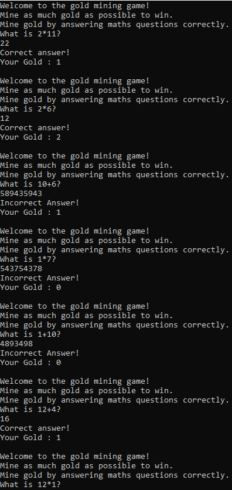

This program comes in two versions: one written entirely in C, and another written partially in C and partially in inline x86 (32-bit) Assembly. The C version can be compiled for either x86 or x64, while the Assembly version can only be compiled for x86, as it uses 32 bit registers (however, it will still run on an x64 processor).
Below is a screenshot showing how the game should look when running.

